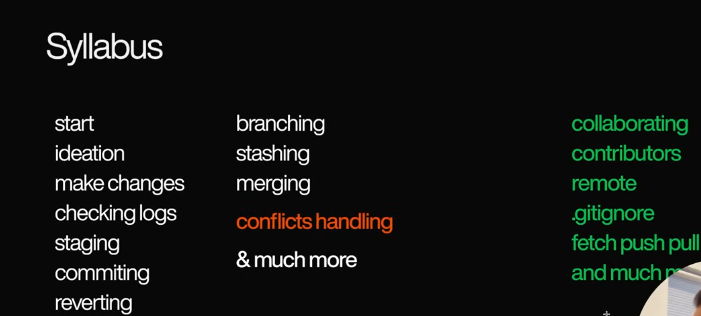

# what to expect

- teaching what matters
- rare cases? use gpt and how to
- NOT for open source!

# main content

### Understand the problem:

- collaboration pov
    - send over WA mail etc

- idea of a central code base
    - SSOT single source of truth
    - working offline locally
    - breif idea of code push and retrival etc collaboration stuff

- the idea of VCS or "git"
    - concept of snapshotting state (like a checkpoint or save point)
    - ctrl Z??? for a 100 files?? nope
    - timeline and code management stuff
    
- git on internet is github

# HANDS ON!

- git installation
- git initial setup

- initialize git repo

stages:
U - untracked
A - added or staged
C - Commited

git log --oneline => to know current status of saved points

- managing your own projects
- making git available in our project
- making a checkpoint or saved point
- adding files
- staging them
- commiting them
- going back to some previous saved point
- logging everything
- reverting back to the previous saved point
- peak into the prev commits

commands you need to know -
git status -s => to know current status of unstaged and staged files

# Branching

- different ppl on diff features
    at the same time
- merging issues with multiple ppl trying to merge 

## visualizing branching
### https://git-school.github.io/visualizing-git/#free

- seeing all branches
- branching out
- swithing branches

# merging

- visualize the merging scenario
- conflict scenarios
- resolving that
    - types of merge on conflicts:
        - three way merge - usual merge
        - ff merge - only 1 branch and no update on main

# stashing

- purpose 
- commands

---

# Collaboration HANDS-ONNNNN!

1. main person inits repo & uploads to github 

2. adding others as collaborators on Github
    
    ---
3. Collaborators clone from the main repo

4. [IMPORTANT!] create their own feature branches and ONLY THEN start to work. Never work or commit to main branch directly unless you know what you're doing

5. commit and push to upstream (github main repo)

6. inform about the commit to the main person

7. main person checks the commits and merges to main.

---

## iF tImE pErMiTs

